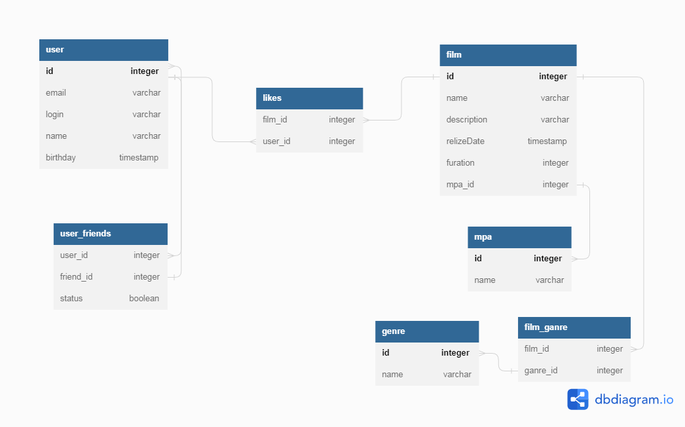

# java-filmorate

FilmRate  - a community for rating and recommending movies.

Technology Stack: Java, Spring Boot, Maven, Lombok, SQL, PostgreSQL, H2, JdbcTemplate, JUnit.

About the Project: This is a RESTful web-service capable of storing data in memory or in a database. CRUD and other database queries are manually written. The retrieved data is processed using RowMapper.

Key Functionality: • User registration and retrieval • Adding users to the friends list • Adding, updating, and deleting movies • Searching for movies by title and director • Adding user reviews for movies

How to Use: Run FilmorateApplication.

# Схема базы данных


# Код из https://dbdiagram.io/d/644cc8f3dca9fb07c43d92be
```
Table film {
  id integer [primary key]
  name varchar
  description varchar
   relizeDate timestamp
   furation integer
   mpa_id integer
}

Table user {
  id integer [primary key]
  email varchar
  login varchar
  name varchar  
  birthday timestamp
}

Table user_friends {
  user_id integer
  friend_id integer
  status boolean
}

Table likes {
  film_id integer
  user_id integer
}

Table film_ganre {
  film_id integer
  ganre_id integer
}

Table genre {
  id integer [primary key]
  name varchar
}

Table mpa {
  id integer [primary key]
  name varchar
}


Ref: "user"."id" < "user_friends"."user_id"

Ref: "user_friends"."friend_id" < "user"."id"

Ref: "film"."mpa_id" < "mpa"."id"

Ref: "film"."id" < "film_ganre"."film_id"

Ref: "film_ganre"."ganre_id" < "genre"."id"

Ref: "user"."id" < "likes"."user_id"

Ref: "film"."id" < "likes"."film_id"
```

# Примеры запросов:
SELECT * FROM user;
SELECT * FROM film;
